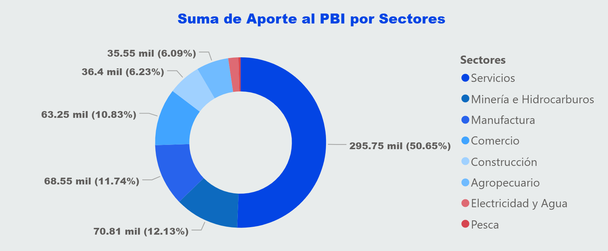

# 📊 Análisis del PBI por Sectores Productivos del Perú (2000 - 2024)

Este proyecto presenta un **dashboard interactivo desarrollado en Power BI** para analizar la evolución del **Producto Bruto Interno (PBI) del Perú por sectores productivos** durante el periodo **2000–2024**.

El objetivo principal fue **poner en práctica el lenguaje DAX y la construcción de dashboards analíticos**, utilizando datos económicos reales obtenidos del Banco Central de Reserva del Perú (BCRP).

---

# 🎯 Objetivo del Proyecto

El proyecto busca desarrollar un dashboard interactivo que permita analizar la evolución del PBI peruano por sectores productivos mediante indicadores clave y visualizaciones dinámicas.

Asimismo, se busca aplicar de forma práctica herramientas de **modelado de datos, limpieza de información y creación de medidas en DAX**, utilizando información económica histórica para generar análisis tanto **verticales (participación sectorial)** como **horizontales (evolución temporal)**.

---

# 🛠 Tecnologías Utilizadas

- **Power BI**
- **Lenguaje DAX (Data Analysis Expressions)**
- **Microsoft Excel** (preprocesamiento de datos)
- Modelado de datos
- Visualización de datos

Fuente de datos:

- **Banco Central de Reserva del Perú (BCRP)**

---

# 📂 Estructura del Proyecto

El repositorio contiene los siguientes archivos:
- Anuales.xlsx # Datos extraídos del BCRP
- PBI por sectores.pbix # Archivo del dashboard en Power BI
- Carátula.png # Imagen de presentación
- Página 2.png # Dashboard de evolución del PBI
- Página 3.png # Dashboard por sectores productivos

---

# 🔄 Proceso de Desarrollo

El desarrollo del proyecto se realizó en las siguientes etapas:

### 1️⃣ Extracción de Datos
Los datos del **PBI por sectores productivos** fueron obtenidos desde el portal del **Banco Central de Reserva del Perú (BCRP)** y exportados a formato Excel.

### 2️⃣ Limpieza y Preparación de Datos
Se realizó un proceso de **limpieza y estructuración de datos en Excel**, organizando la información en formato tabular para su correcta importación en Power BI.

Las principales tareas fueron:

- Estandarización de nombres de variables
- Eliminación de datos innecesarios
- Organización de la información por **año y sector productivo**

### 3️⃣ Modelado de Datos
Los datos fueron cargados en **Power BI**, donde se estructuró el modelo de datos para permitir análisis dinámicos.

### 4️⃣ Creación de Medidas con DAX
Se desarrollaron diversas **medidas en DAX** para calcular indicadores relevantes como:

- Variación anual del PBI
- Crecimiento acumulado
- Participación sectorial
- Máximos y mínimos históricos
- Identificación de sectores con mayor crecimiento o caída

### 5️⃣ Construcción del Dashboard
Se diseñó un **dashboard interactivo** con visualizaciones que permiten analizar la evolución del PBI y su composición sectorial.

---

# 📊 Funcionalidades del Dashboard

El dashboard incluye las siguientes funcionalidades:

### 📈 Indicadores Clave (KPIs)

- PBI actual
- Variación acumulada del PBI
- Máximo histórico de PBI
- Mínimo histórico
- Año con mayor expansión económica

---

### 🧩 Análisis por Sectores Productivos

- Participación sectorial en el PBI
- Sector con mayor aporte al PBI
- Sector con mayor crecimiento
- Sector con mayor caída
- Crecimiento acumulado por sector

---

### 📅 Filtros Dinámicos

El dashboard incluye **segmentadores por año**, lo que permite analizar:

- Evolución del PBI a lo largo del tiempo
- Comparación entre periodos
- Cambios en la estructura productiva

---

### 📉 Visualizaciones

El proyecto incluye:

- Gráfico de evolución del PBI
- Gráficos de participación sectorial
- KPIs dinámicos
- Panel de indicadores económicos

---

# 📌 Aprendizajes del Proyecto

Este proyecto permitió fortalecer habilidades en:

- **Lenguaje DAX**
- **Modelado de datos en Power BI**
- **Creación de dashboards analíticos**
- **Transformación y limpieza de datos**
- **Análisis económico aplicado a visualización de datos**

---

# 👤 Autor

**Luis Fernando Chávez Boza**

Economista interesado en análisis de datos, visualización y análisis económico aplicado.

---

# 📎 Fuente de Datos

Banco Central de Reserva del Perú (BCRP)
